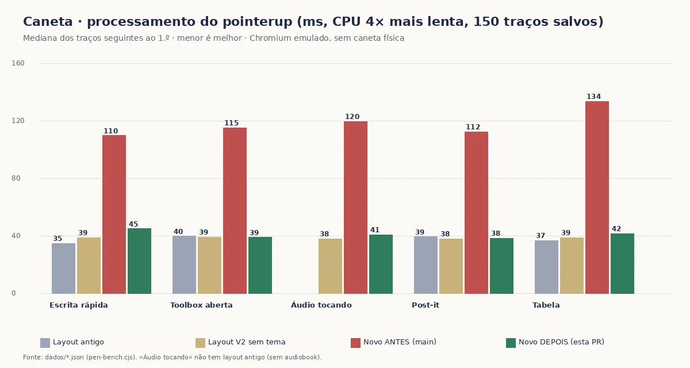

# Caneta no novo layout — evidência antes/depois (issue #456)

**Problema (José):** no layout novo da Semiología II a caneta «atrasa e às vezes perde partes do traço»; no antigo funcionava melhor.
**Método:** `../../pen-bench.cjs` — gestos pela pipeline REAL do Chromium (CDP `Input.dispatchMouseEvent` `pointerType:'pen'`), motor da caneta REAL (`rm-tools-v2.js`), matéria REAL, 150 traços já salvos, toolbox aberta pela UI quando indicado,
Event Timing API + `longtask` + rAF + `Performance.getMetrics`. «ANTES» = `main` (f6547a7, pós-#454) · «DEPOIS» = esta PR · mesma máquina e mesmos gestos, uma árvore após a outra (sem rodar em paralelo). Configurações: **antigo** (`layout:false`) · **layout** (V2 sem tema) · **novo** (V2 + tema + navegação).
Dados brutos: `dados/*.json` (um registro por repetição). Emulação do Chromium; **sem caneta física** (ver «Limites»).

## Resultado

No layout novo o **levantar da caneta (pointerup) custava ≈ 3× o do antigo/layout** (110–134 ms contra 35–40 ms com a CPU 4× mais lenta; 22–24 ms contra ≈ 8 ms em CPU normal). Era o instante em que o aluno acabava de escrever uma letra/palavra: a tinta já estava na tela, mas a thread principal ficava presa e a próxima letra começava atrasada.
Com a correção o novo fica **igual ao antigo/layout** em todos os gestos (escrita rápida, toolbox aberta, áudio tocando, post-it, tabela; desktop 1440 e celular 390).

### Causas medidas (nenhuma deduzida só por leitura do código)
1. **Espelho da toolbox forçava layout a cada traço** (`rm-materia-sistema.js`, `ferramentas()` → `sync`): lia `getComputedStyle` + `getBoundingClientRect` em cada reescrita de `aria-expanded` do FAB; a V2 reescreve esse atributo **a cada traço** (`refletir()`), com o painel aberto — estilo + layout síncronos de ~16 mil nós logo após o pointerup. Correção: só mede quando abriu/fechou/armou de verdade ou a geometria mudou (ResizeObserver da caixa + `resize`). **−70 ms (4×) no pointerup.**
2. **`:has()` de `rm-audio.css` varria o documento** a cada mutação do `<body>` (traço, classes `rm2-pen-down`/`rm2-drawing`, tick do player 4×/s) quando o player está no modo lateral (o do piloto): a regra nunca casa e o Chromium re-testa o `<body>` inteiro. Correção: os dois fallbacks passam a usar só combinadores de filho ancorados no slot (mesma declaração; tema/semântica iguais). **Tick do player (timeupdate → render): 12–13 ms → ≈ 5–7 ms (4×).**
3. **`rm-sis-aud-dot` animava `background-size`** (repinta na thread principal enquanto o áudio toca). Agora só `opacity` (compositor).

### Pontos perdidos
**0 perdidos em todas as medições** — antes e depois — em 132 traços / 47 388 pontos enviados (parágrafo, post-it, toolbox, player; antigo/layout/novo; desktop e celular), mais 6 462 pontos em tabela, rajadas enviadas sem esperar o ack, CPU 4×; cada ponto enviado dista ≤ 1,6 px da polilinha gravada (`caneta-novo-layout.test.cjs`, C). **Não consegui reproduzir «perde partes do traço» no Chromium emulado.** A explicação mais provável, que só o aparelho dele confirma, é o atraso acima somado a interrupções que o emulador não gera (o motor descarta o traço inteiro em `pointercancel`/perda de captura, p. ex. rejeição de palma ou gesto do sistema). Por isso o **PASSO FINAL** abaixo.

## CPU 4× mais lenta · desktop 1440×900 (150 traços salvos)
Mediana das repetições; traços «quentes» (2.º em diante) salvo onde dito. ms.

| gesto | config | pointerup: processamento JS (antes → depois) | pointerup: duração até o quadro | pointermove p95 | tinta p95 | pior quadro | tarefas longas | CPU/quadro | pontos perdidos (antes → depois) |
|---|---|---|---|---|---|---|---|---|---|
| player | layout | 38 → 41,7 | 120 → 112 | — → — | 15 → 15,1 | 99,9 → 100 | 2 → 2 | 11,3 → 11,9 | 0/4308 → 0/4308 |
| player | novo | 119,5 → 40,8 | 144 → 128 | — → — | 15,2 → 15 | 116,6 → 100 | 2 → 2 | 9,1 → 9,8 | 0/4308 → 0/4308 |
| postit | antigo | 39,3 → 39,9 | 112 → 112 | — → — | 15,4 → 15,2 | 83,4 → 100 | 2 → 2 | 9,7 → 9,6 | 0/4308 → 0/4308 |
| postit | layout | 37,9 → 40,6 | 112 → 120 | — → — | 15,1 → 15,1 | 99,9 → 100 | 2 → 2 | 10,2 → 10,5 | 0/4308 → 0/4308 |
| postit | novo | 112,3 → 38,3 | 120 → 112 | — → — | 15,2 → 15,2 | 116,6 → 83,4 | 2 → 2 | 7,7 → 6,6 | 0/4308 → 0/4308 |
| rapido | antigo | 34,7 → 36,1 | 176 → 176 | — → — | 15,2 → 15,3 | 150 → 150 | 2 → 2 | 14,3 → 13,4 | 0/4308 → 0/4308 |
| rapido | layout | 38,7 → 38,5 | 120 → 104 | — → — | 15 → 15,1 | 100 → 100 | 2 → 2 | 11,3 → 11 | 0/4308 → 0/4308 |
| rapido | novo | 109,7 → 44,9 | 120 → 120 | — → — | 15,1 → 15,3 | 116,7 → 100 | 2 → 2 | 7,3 → 6,8 | 0/4308 → 0/4308 |
| toolbox | antigo | 39,7 → 39,2 | 176 → 192 | — → — | 15,2 → 15,2 | 150 → 166,6 | 2 → 2 | 14,6 → 14,6 | 0/4308 → 0/4308 |
| toolbox | layout | 39,2 → 39,9 | 136 → 120 | — → — | 15,1 → 15,1 | 116,6 → 116,7 | 2 → 2 | 10,8 → 10,7 | 0/4308 → 0/4308 |
| toolbox | novo | 115,2 → 38,9 | 128 → 128 | — → — | 15,2 → 15,1 | 100,1 → 116,6 | 2 → 2 | 7 → 7,4 | 0/4308 → 0/4308 |

| tabela | layout | 38,7 → 41,4 | 144 → 144 | — → — | 14,8 → 14,6 | 116,7 → 133,3 | 2 → 2 | 10,3 → 10,2 | 0/6462 → 0/6462 |
| tabela | novo | 133,6 → 41,5 | 144 → 136 | — → — | 14,8 → 14,9 | 133,4 → 116,7 | 2 → 2 | 7,8 → 8,4 | 0/6462 → 0/6462 |

## CPU normal (1×) · desktop 1440×900
Mediana das repetições; traços «quentes» (2.º em diante) salvo onde dito. ms.

| gesto | config | pointerup: processamento JS (antes → depois) | pointerup: duração até o quadro | pointermove p95 | tinta p95 | pior quadro | tarefas longas | CPU/quadro | pontos perdidos (antes → depois) |
|---|---|---|---|---|---|---|---|---|---|
| player | layout | 8,8 → 9 | 24 → 24 | — → — | 16 → 15,9 | 16,8 → 16,8 | 0 → 0 | 2,7 → 3,7 | 0/4308 → 0/4308 |
| player | novo | 24,4 → 9,3 | 64 → 32 | — → — | 16,1 → 16 | 16,8 → 16,8 | 0 → 0 | 2,2 → 2,5 | 0/4308 → 0/4308 |
| rapido | antigo | 8,4 → 8,3 | 48 → 48 | — → — | 16 → 16 | 33,3 → 16,8 | 0 → 0 | 3,3 → 3,7 | 0/4308 → 0/4308 |
| rapido | layout | 9,6 → 7,8 | 32 → 24 | — → — | 15,9 → 15,9 | 16,8 → 16,8 | 0 → 0 | 2,8 → 2,8 | 0/4308 → 0/4308 |
| rapido | novo | 23,1 → 8,9 | 24 → 24 | — → — | 16 → 16 | 16,8 → 16,8 | 0 → 0 | 1,7 → 1,9 | 0/4308 → 0/4308 |
| toolbox | antigo | 8,3 → 8,4 | 48 → 48 | — → — | 16 → 16 | 16,8 → 33,3 | 0 → 0 | 3,5 → 3,9 | 0/4308 → 0/4308 |
| toolbox | layout | 8,8 → 8,9 | 24 → 24 | — → — | 16 → 15,9 | 16,8 → 16,8 | 0 → 0 | 2,6 → 2,9 | 0/4308 → 0/4308 |
| toolbox | novo | 22,2 → 8,9 | 24 → 24 | — → — | 16,1 → 15,9 | 16,8 → 16,8 | 0 → 0 | 1,7 → 2,1 | 0/4308 → 0/4308 |

## Celular 390×844 (toque emulado, 2×), CPU 4× mais lenta
Mediana das repetições; traços «quentes» (2.º em diante) salvo onde dito. ms.

| gesto | config | pointerup: processamento JS (antes → depois) | pointerup: duração até o quadro | pointermove p95 | tinta p95 | pior quadro | tarefas longas | CPU/quadro | pontos perdidos (antes → depois) |
|---|---|---|---|---|---|---|---|---|---|
| player | layout | 38,8 → 39,9 | 112 → 120 | — → — | 15,2 → 15 | 83,4 → 100 | 2 → 2 | 9,2 → 11,5 | 0/4308 → 0/4308 |
| player | novo | 114,7 → 44,1 | 128 → 136 | — → — | 15,6 → 15 | 100 → 116,6 | 2 → 2 | 7,2 → 9 | 0/4308 → 0/4308 |
| toolbox | antigo | 35,1 → 37,6 | 104 → 112 | — → — | 15,1 → 14,6 | 83,4 → 100 | 2 → 2 | 8,9 → 11,9 | 0/4308 → 0/4308 |
| toolbox | layout | 36,7 → 37,3 | 120 → 112 | — → — | 15,2 → 15 | 100 → 83,3 | 2 → 2 | 8,8 → 10,7 | 0/4308 → 0/4308 |
| toolbox | novo | 115,1 → 41,1 | 128 → 120 | — → — | 15,6 → 15,2 | 99,9 → 100 | 2 → 2 | 6,1 → 7,2 | 0/4308 → 0/4308 |

Colunas: *processamento JS do pointerup* = Event Timing `processingEnd − processingStart` (o que a correção ataca) · *duração até o quadro* = `duration` do Event Timing (arredondada a 8 ms pelo Chromium) ·
*pointermove p95* aparece «—» porque nenhum pointermove passou do limiar de 16 ms (a escrita em si nunca foi o gargalo) · *tinta p95* = ms do pointermove até o 1.º quadro que já contém o ponto (≈ 1 quadro de 60 Hz em todas as configs) ·
*pior quadro* e *tarefas longas* incluem a cauda do pointerdown/pointerup (o pointerdown custa ≈ 80–120 ms a 4× nas TRÊS configs, antigo inclusive, por causa dos 150 traços salvos — preexistente, não é regressão do novo layout e não foi tocado).
A coluna «pontos perdidos» do bloco 4× de desktop exclui tabela (ver linha própria, repetida com 3 repetições × 6 traços depois de corrigir um artefato do medidor: a ordem no DOM não é a ordem de criação do traço).

## Testes
- `caneta-novo-layout.test.cjs` — **89/89**; no código anterior (`main`) reprova **7** (A estático ×3, B layout/escrita de `--rm-dock-h` ×4) e o tick do player (H) fica 3,7× o do layout (limite 3×).
- Regressão completa verde com a correção: `sistema` 124 · `player-sistema` 275 · `player-toolbox` 495 · `audio` 589 · `pilot-gancho` 72 · `caneta-real` 137 · `layout` 535 · `nav-sistema` 216.

## Limites (declarados)
- **Chromium emulado, sem stylus físico.** O CDP gera `pointerType:'pen'`, mas não pressão real, inclinação, hover, nem as interrupções do sistema operacional (rejeição de palma, gesto de borda, Apple Pencil/Windows Ink). Toque e mouse foram testados; stylus real **não**.
- Latência medida é a da thread principal do navegador (Event Timing/rAF), não a latência óptica do aparelho (digitalizador → tela).
- Perda parcial do traço no aparelho de José: **não reproduzida**; fica para o teste dele (`PASSO-FINAL-JOSE.md`).
