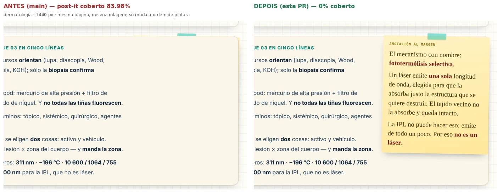
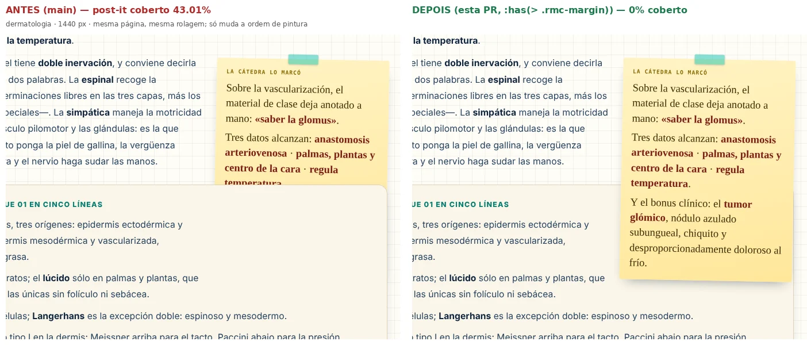
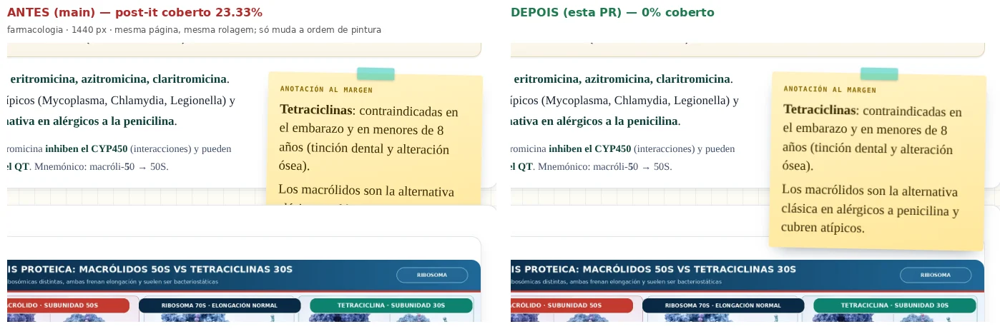

# Post-its/notas laterais encobertos — evidência antes/depois (issue #93)

**Relato (José):** em algumas matérias, post-its/notas importantes que aparecem na lateral ficam tapados por outra parte da interface. **Método:** `../../postits-93.probe.cjs` mede, em TODAS as 30 matérias reais (`netlify/functions/materias-privadas/`) a 390/768/1024/1440 px, cada post-it (`.rmc-margin` + legados `*-postit`) em 3 posições de rolagem (centro · logo abaixo do cabeçalho · rente ao rodapé) comparando **por pixel** a região visível «como está» com a mesma região mostrando só o post-it (o aluno só vê o que PINTA); mais hit-test, recorte lateral, overflow horizontal, UI fixa sobreposta e 464 aberturas do glossário `#rm-gl-note`. «ANTES» = `main` (899d74d) · «DEPOIS» = esta PR. Dados brutos: `dados/*.ndjson`. Emulação do Chromium.

## Quais mecanismos falham (e quais não)
| mecanismo | veredito | onde / quando |
|---|---|---|
| `.rmc-margin` **dentro de um filho de `.container`** (`.rmc-detalle`, `.pk-step`, `.analysis-card`, `figure`…), `float:right` ≥ 920 px | **FALHA** — o filho é contexto de apilamiento (`.container>*{position:relative;z-index:1}`), o `z-index:2` do post-it fica preso nele e o **irmão seguinte** (z:1, depois no DOM) pinta POR CIMA do post-it que cuelga abaixo do pai | Dermatología (2 de 5 que cuelgam; 43 % e 84 % do post-it coberto), Farmacología (1 de 1; 23 %), 1024 e 1440 px |
| `.rmc-margin` **filho direto** de `.container` | OK desde a #370 (`z-index:2`) | 0 cobertos |
| < 920 px (post-it não flutua) | OK | 0 cobertos em 390 e 768 |
| legados `a1-/em-/f2-/hi-/bio-…postit` (em fluxo) | OK | 0 cobertos |
| glossário `#rm-gl-note` | **sem defeito**: popover (top layer) + fallback `position:fixed` z 2147483000; sempre 100 % dentro da janela | 464 aberturas, 0 recortes/0 cobertos (com e sem Popover API: `postits-encobertos.test.cjs`, E) |
| controles flutuantes (menu, ferramentas, «Salir») | só encostam na MARGEM/borda de post-its largos no celular, transitório (sai rolando); sem perda de texto medida | informativo; não alterado |
| overflow horizontal | 0 em 120 combinações matéria × largura | — |

## Antes × depois (mesma página, mesma rolagem; só muda a ordem de pintura)
Dermatología 1440 — nota 12 (84 % coberta → 0 %) e nota 4 (43 % → 0 %); Farmacología 1440 — nota 17 (23 % → 0 %). Também 1024 px. Arquivos `antes-depois_*.webp` + `casos.json`.

## Varredura completa (30 matérias × 4 larguras = 120; 908 post-its amostrados, 2 724 posições)
| | post-its cobertos | glossário c/ problema | overflow horizontal | erros JS |
|---|---|---|---|---|
| ANTES (`main`) | **8** (Dermatología 2+2, Farmacología 1+1, Oftalmología 1+1 *) | 2 ** | 0 | 0 |
| DEPOIS (esta PR) | **2** (só Oftalmología *) | 2 ** | 0 | 0 |

\* Oftalmología 1024/1440: falso positivo da métrica da varredura (um post-it lateral que pinta sobre a área VAZIA de um callout largo cujo texto o contorna — o desenho original; não há texto coberto). A sonda atual já ignora outros floats (0/36).
\*\* Em ambas as árvores: o TERMO (não o post-it) a 40 px do rodapé fica sob um controle flutuante (`rm-menu`/ferramentas) — transitório; o post-it do termo abre normal.

## Limites
Chromium emulado (não é o aparelho do José); a varredura usa uma amostra de até 6 post-its por matéria + TODOS os que cuelgam do pai; o Layout V2 (lateral/faixa/toolbox) só liga em Semiología II (piloto) — testado lá (com e sem tema). Safari/Firefox antigos sem `:has()`: ficam como hoje (sem a correção, sem regressão).
